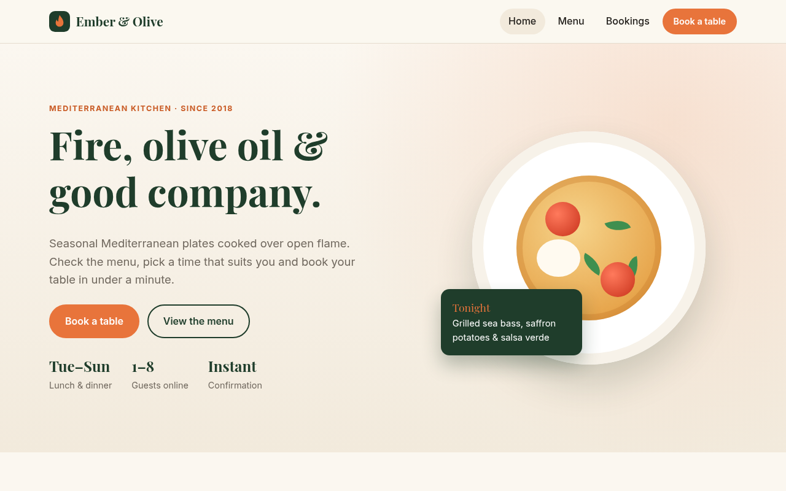
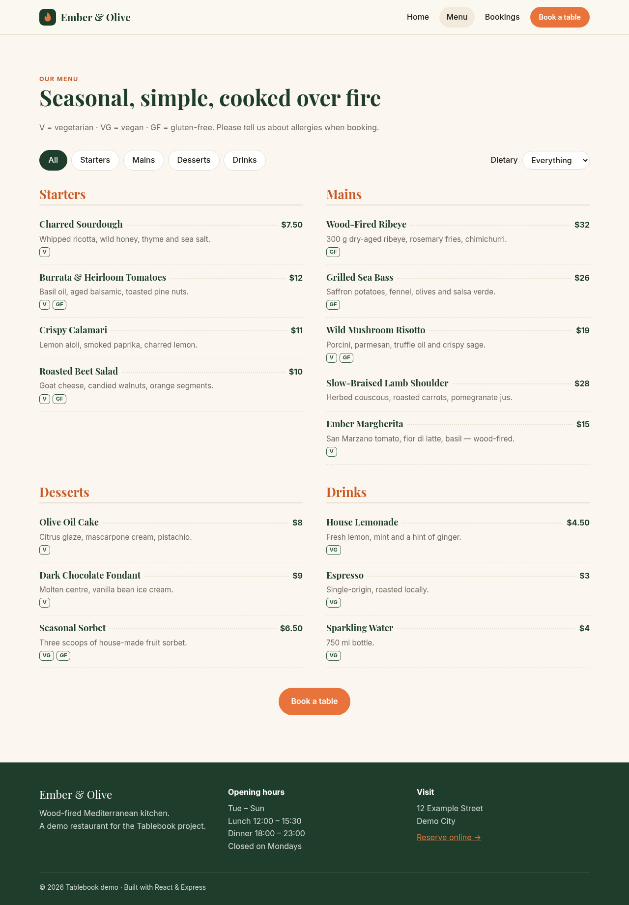
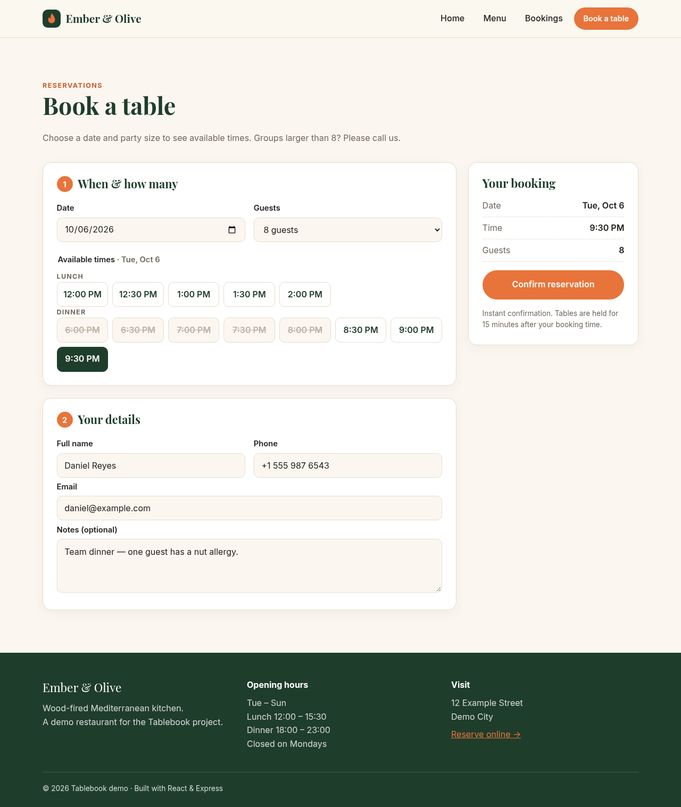
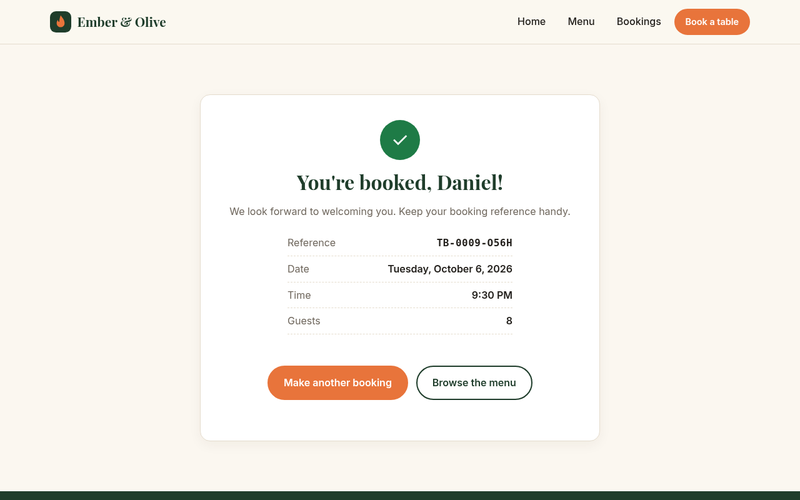
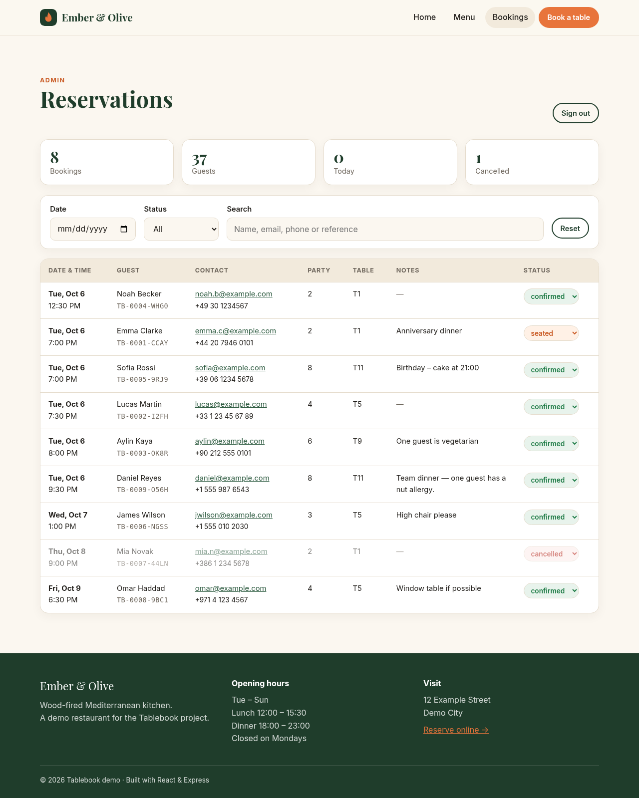
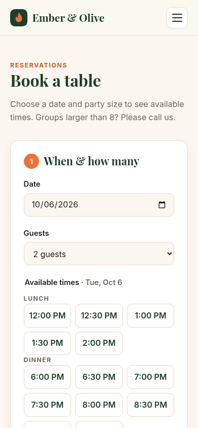

# 🍽️ Tablebook

A restaurant website with online **table reservations**, built with a **React (Vite)** frontend and a **Node.js + Express** API. Guests browse the menu, pick a date and party size, see live availability and book instantly; staff manage bookings in a simple admin view.

The demo restaurant is **Ember & Olive**, a fictional wood-fired Mediterranean kitchen.

> Portfolio project by **Amir Namvar** – full-stack web developer.

---

## ✨ Features

**Guest-facing site**
- **Home page** with hero, highlights and call-to-action.
- **Menu page** loaded from the API – category tabs, dietary filter (vegetarian / vegan / gluten-free) and price list.
- **Reservation flow** – date picker, party size (1–8), time slots grouped by lunch / dinner, contact details and notes, plus a live booking summary.
- **Validation on both sides** – past dates, closed days (Mondays), booking window (60 days ahead), party size, same-day lead time (1 hour), email and phone format; field-level error messages.
- **Real availability check** – the API assigns the *smallest free table that fits the party* and blocks it for the dining duration (90 min), so overlapping bookings can't double-book a table. Race conditions return `409` and the slots refresh.
- **Confirmation screen** with a booking reference (e.g. `TB-0009-056H`).

**Admin**
- **Bookings list** protected by an admin key (`X-Admin-Key` header, kept in `sessionStorage`).
- Filters by date, status and free-text search (name, email, phone, reference).
- Inline status changes: *confirmed, seated, completed, cancelled, no-show*. Cancelling frees the table; re-activating checks the table is still free.
- Quick stats: bookings, guests, today, cancelled. Table turns into cards on mobile.

**Quality**
- Responsive from 320 px to large desktops, accessible forms (labels, `aria-invalid`, live error regions), keyboard-friendly slot buttons, skip link.
- JSON file store with atomic writes – no database setup needed.
- API tests with Node's built-in test runner using an injectable clock.

## 🛠 Tech Stack

| Layer    | Technology |
|----------|------------|
| Frontend | React 19, Vite 7, React Router 7, plain CSS (custom properties) |
| Backend  | Node.js 20+, Express 5, cors |
| Storage  | JSON file (`server/data/reservations.json`) behind a small repository class |
| Testing  | `node:test` + native `fetch` |

## 📸 Screenshots

| Home | Menu |
|------|------|
|  |  |

| Reservation form | Confirmation |
|------------------|--------------|
|  |  |

| Admin bookings | Mobile |
|----------------|--------|
|  |  |

## 🚀 Getting Started

### Prerequisites

- **Node.js** 20.19+ (or 22.12+) and npm

### 1. Clone the repository

```bash
git clone https://github.com/som-info/tablebook.git
cd tablebook
```

### 2. Start the API

```bash
cd server
npm install
npm run dev          # http://localhost:4200
```

Run the API tests:

```bash
npm test
```

### 3. Start the frontend

In a second terminal:

```bash
cd client
npm install
npm run dev          # http://localhost:5173
```

Vite proxies `/api` to `http://localhost:4200`. Open <http://localhost:5173>, make a booking, then visit **Bookings** (`/admin`) and sign in with the development key `admin-demo`.

### Production

```bash
cd client && npm run build                        # creates client/dist
cd ../server && ADMIN_KEY=your-long-secret NODE_ENV=production npm start
```

The Express server serves the built client and the API from one port. If the client is hosted elsewhere, set `VITE_API_URL` (see `client/.env.example`) and add its origin to `CLIENT_ORIGIN`.

### Environment variables (server)

| Variable        | Default                     | Description |
|-----------------|-----------------------------|-------------|
| `PORT`          | `4200`                      | API port |
| `ADMIN_KEY`     | `admin-demo` (dev only)     | Key for admin endpoints. **Required when `NODE_ENV=production`.** |
| `CLIENT_ORIGIN` | `http://localhost:5173`     | Allowed CORS origin(s), comma-separated |
| `DATA_FILE`     | `data/reservations.json`    | JSON data file |

Opening hours, tables, dining duration and booking rules live in `server/src/restaurant.js`; the menu lives in `server/src/menu.js`.

## 🔌 API Reference

| Method | Endpoint | Description |
|--------|----------|-------------|
| GET    | `/api/health` | Health check |
| GET    | `/api/restaurant` | Name, services, booking limits |
| GET    | `/api/menu` | Menu grouped by category |
| GET    | `/api/availability?date=YYYY-MM-DD&partySize=N` | Slots for the day with `available` flags, or a `reason` when the date can't be booked |
| POST   | `/api/reservations` | `{ name, email, phone, date, time, partySize, notes? }` → `201` with reference code; `400` validation errors; `409` slot taken |
| GET    | `/api/admin/reservations?date=&status=&q=` | List bookings *(X-Admin-Key)* |
| PATCH  | `/api/admin/reservations/:id` | `{ status }` *(X-Admin-Key)* |

Example availability response:

```json
{
  "date": "2026-10-06",
  "partySize": 8,
  "open": true,
  "slots": [
    { "time": "12:00", "service": "Lunch", "available": true },
    { "time": "19:00", "service": "Dinner", "available": false }
  ]
}
```

## 📁 Project Structure

```
tablebook/
├── client/                      # React frontend
│   ├── src/
│   │   ├── api/client.js        # fetch wrapper (errors, admin key)
│   │   ├── components/          # Header, Footer, Logo, ScrollToTop
│   │   ├── pages/               # HomePage, MenuPage, ReservePage, AdminPage, NotFoundPage
│   │   ├── utils.js             # date / time / price helpers
│   │   ├── App.jsx              # routes
│   │   ├── index.css
│   │   └── main.jsx
│   ├── index.html
│   ├── package.json
│   └── vite.config.js
├── server/                      # Express API
│   ├── src/
│   │   ├── app.js               # routes and admin router
│   │   ├── availability.js      # slot generation and table assignment
│   │   ├── validate.js          # reservation validation
│   │   ├── store.js             # JSON file store
│   │   ├── restaurant.js        # hours, tables, booking rules
│   │   ├── menu.js              # menu data
│   │   ├── config.js
│   │   └── index.js
│   ├── tests/api.test.js
│   ├── data/                    # runtime data (git-ignored)
│   ├── .env.example
│   └── package.json
├── docs/screenshots/
├── LICENSE
└── README.md
```

## 🗺 Possible Improvements

- Email / SMS confirmations and reminders
- Proper staff accounts instead of a shared admin key
- Combining tables for large groups, floor-plan view
- Database storage (PostgreSQL) and a timezone setting per restaurant

## 📄 License

This project is licensed under the [MIT License](LICENSE).

---

Made with ❤️ by [Amir Namvar](https://github.com/som-info)
